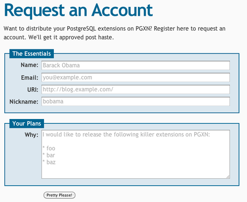
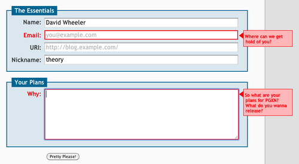
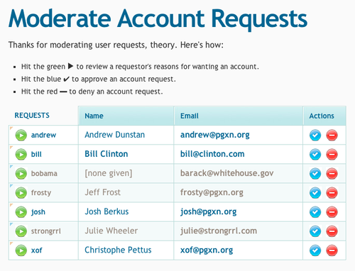
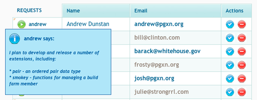

Last week I created the [PGXN Manager] interface for requesting a PGXN user
account. It looks like this:

I really like the placeholder support in HTML 5, here nicely rendered by
Safari. I've also used the jQuery [Validation plugin] to validate the form
fields. So if you try to submit an incomplete form, it will complain before
submitting, like so:

The back end does similar validation if you have JavaScript disabled, so it
should degrade nicely. I think I might add a Twitter field so [@pgxn] can
credit users for their uploads, but otherwise this is done.

As with [PAUSE], an administrator must accept it or reject an account request.
Once your account is approved (likely unless you're a spammer), you'll be able
to upload distributions (I'm going to do that part today). I finished the user
admin interface yesterday. Here's a screen snap:

Some details. PGXN Manager will be hosted at [`https://manager.pgxn.org/`]. It
uses basic auth for authentication; logged-in users will access
[`https://manager.pgxn.org/auth`]. Administrators will have an extra menu item
to this screen, which will allow them to accept or reject account requests.
Its URI is `/auth/admin/moderate`. The admin can click the "Play" button to
see the requestor's note explaining why he should get an account. It's a
popover enabled by some jQuery code and looks like this:

Once an admin has read the request, she can accept it by clicking the blue
checkmark icon, or reject it by clicking the red minus icon. The former links
to `/auth/admin/accept/{nickname}` and the latter to
`/auth/admin/reject/{nickname}`. The submits are done by jQuery async requests
by default, but if you have JavaScript disabled they will submit as usual and
the back end will process the request and simply redirect to the moderation
screen.

This works very well, I think. It's an attractive interface and degrades
reasonably well. (Well, you can't read the request details if you have
JavaScript disabled, but the requests work nicely). The jQuery code fades out
a row after it has been accepted or rejected, so it's easy for an admin to do
a bunch of moderation all at once. And finally, the interface is driven by the
URLs, so I think it's pretty restful. The only ones I'm not sure about are the
accept/reject URLs, because they have action names in them ("accept" and
"reject"). Is that RESTful? Or should they use GET query strings or something?

Okay, on to the upload interface. Wish me luck!

  [PGXN Manager]: https://github.com/theory/pgxn-manager
    "PGXN Manager repository on GitHub"
  [Validation plugin]: https://docs.jquery.com/Plugins/Validation
  [@pgxn]: https://twitter.com/pgxn
  [PAUSE]: https://pause.perl.org/
    "The [Perl programming] Authors Upload Server"
  [`https://manager.pgxn.org/`]: https://manager.pgxn.org/
  [`https://manager.pgxn.org/auth`]: https://manager.pgxn.org/auth
