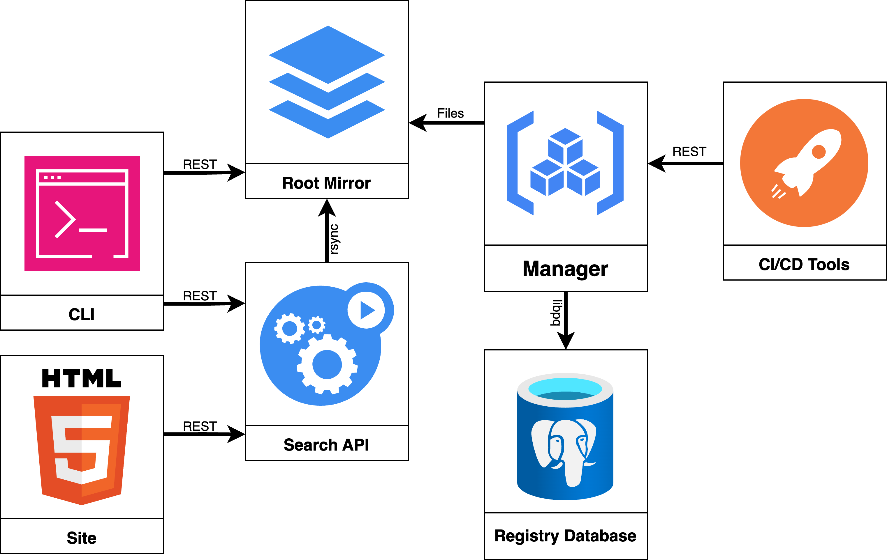

[][link]

The Tembo blog has posted a presentation on the PGXN architecture. There
hasn't been much coverage of it since a few posts here on the PGXN blog back
in 2012, so worth a revisit --- and a fair bit changed in the interim, as
well!

  [link]: https://tembo.io/blog/pgxn-architecture
