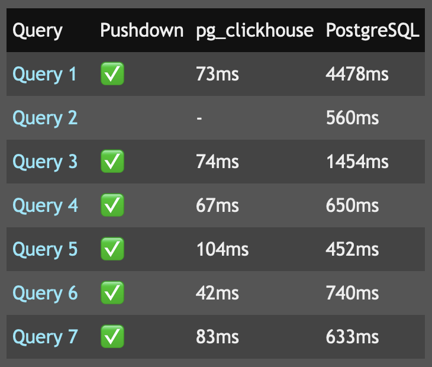

Quick announcement to say that I've replaced the ancient markdown parser with
a new one, [discount], which supports tables, code fences, definition lists,
and more. I reindexed [pg_clickhouse] this morning and it's sooo nice to see
[the table] properly formatted.

New uploads will use this parser for Markdown (but not MultiMarkdown) files
from now on. I think I'll start working on reindexing all existing extensions,
too. Give me a holler if you don't see an improvement in your extensions in
the next few days.

  [discount]: https://www.pell.portland.or.us/~orc/Code/discount/
  [pg_clickhouse]: https://pgxn.org/dist/pg_clickhouse "pg_clickhouse on PGXN"
  [the table]: https://pgxn.org/dist/pg_clickhouse/0.1.0/#Test.Case:.TPC-H
